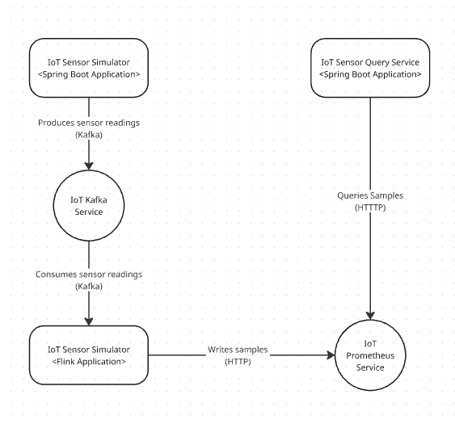

# IoT System

## Context

IoT devices send out continuous data which we want to collect (e.g., thermostat, heart rate meter,
car fuel readings, etc.). Your task is to build a pipeline via which we can process the IoT data in a
scalable manner. In addition to that, we want to have a secure web service for querying the
readings (e.g., average/median/max/min values) of specific sensors or groups of sensors for a
specific timeframe.

---

## Setup

### Requirements
- JDK 17+
- Maven
- Docker

### Instructions
1. Navigate to the root directory of the project.
2. Build the project: **mvn clean install**
3. Deploy the infra dependencies: **docker-compose up -d** (ensure all services start up successfully)
4. Start the IoT Sensor Collector Application: **java --add-opens "java.base/java.util=ALL-UNNAMED" -jar ./iot-sensor-reading-collector/target/iot-sensor-reading-collector-1.0.0-jar-with-dependencies.jar > collector.log &**
5. Start the IoT Sensor Query Service: **mvn -f ./iot-sensor-query-service/ spring-boot:run > query_service.log &**
6. Start the IoT Sensor Simulator Application: **mvn -f ./iot-sensor-simulator/ spring-boot:run > simulator.log &**
7. (Optional) Run the integration tests: **mvn failsafe:integration-test**

At this stage the applications should be actively logging sensor readings being generated and streamed over the pipeline. 
IoT Query Service should also be accessible at http://localhost:8080 using username "user" and password "password" (by default). 
The sensor readings can be queried as follows:

http://localhost:8080/api/v1/sensor/{sensorId}?start={start}&end={end}

Where sensorId is an alphanumeric string and start and end are ISO 8601 formatted date strings. For example:

http://localhost:8080/api/v1/sensor/hm3?start=2025-11-21T00:00:00.000Z&end=2025-11-21T23:00:00.000Z

Or to query a sensor group (groupId is also alphanumeric):

http://localhost:8080/api/v1/sensor/group/medical?start=2025-11-21T00:00:00.000Z&end=2025-11-21T23:00:00.000Z

---

## Architecture

- IoT Device Data Generation 
  - Spring Boot selected for ease of configuration, scheduling and provisioning of Kafka Producer.
  - Streaming performed using Kafka for performance, scalability, reliability and ubiquity (ease of operation as a managed service, availability of framework connectors).
- Continuous Data Processing & Storage
  - Streaming data processing performed by Flink for:
    - Performance - excels at real-time, low-latency workloads.
    - Scalability - elastic scaling can be configured.
    - Reliability - robust fault tolerance providing through checkpoint mechanism, which can be configured for durable storage if required.
    - Operability - deployable in containerised form and/or as a managed service.
    - Extensibility - topology can easily be extended to perform additional computation if required.
  - Persistence handled by Prometheus given the appropriate use case for a Time Series Database, query functionality and ease of deployment and operation as a managed service.
- Data Query Service
  - Spring Boot selected for ease of configuration and provisioning of application server and secure REST service.

### Component Level Diagram

### Production Deployment

AWS would be the ideal production environment as Amazon provides managed services for a number of key choices of technology, namely Kafka (MSK), Flink (MSF) and Prometheus (AMP).
In this configuration the Flink application is deployed as a "job" onto the managed cluster. The cluster is configured by default to auto-scale depending on container CPU utilisation, but can be configured to target other CloudWatch-provided metrics. The Flink dashboard is also accessible, which provides convenient in-depth monitoring of the Flink topology.

The IoT Sensor Query Service (as a stateless application) could be deployed cost-efficiently on any AWS infrastructure that supports auto-scaling (primarily in order to scale down the service is not in use). AWS Fargate ECS might be a sensible choice for this use case.

The system can be configured to stream and consume sensor readings from one or more Kafka topics. It may be necessary as the system evolves to support additional IoT sensor types and devices that generate large numbers (millions) of readings per hour, in which case it may be necessary to create dedicated Kafka topics that can be configured independently.

### Development Notes and Potential Improvements

- Performance tests - the system is currently lacking performance tests that validate that the system can accommodate a specified rate of simulated sensor readings while maintaining acceptable throughput and latency.
- Component tests - the system is currently lacking component tests that validate that each component produces the expected output(s) for the given input(s) without relying on real infrastructure (Prometheus in this case).
- Unit and Integration tests - are not comprehensive in their current state. **Note: there is a known issue with integration tests failing on the first run and then passing for all runs thereafter.**
- Prometheus Query Optimisation - IoT Sensor Query Service is currently requesting all samples from Prometheus within a given date/time range rather than utilising the full and far more efficiency querying functionality provided by Prometheus.
- Message format - the system is currently transmitting sensor readings in JSON format rather than using Protobuf which would provide numerous benefits such as type-safety, faster (de)serialisation and support for backwards compatibility.
- Build and deployment - the system could be fully built and deployed using Docker containers thereby eliminating the need for the user to have Java and Maven installed in order to operate the system.
- Comments - the codebase is severely lacking comments in its current form.